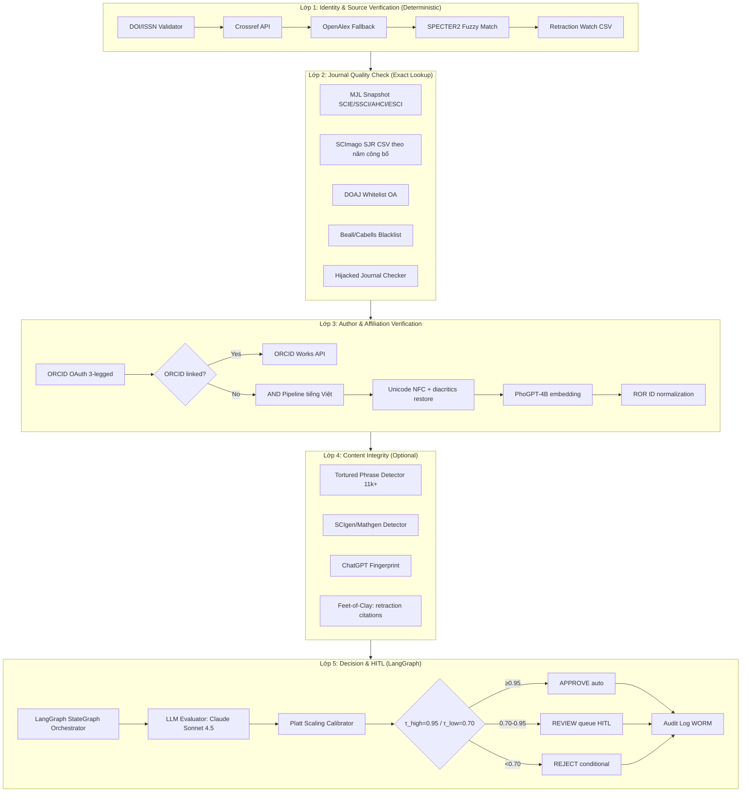

# ReviewAgent PTIT — Kế hoạch Triển khai Kỹ thuật

## Tổng quan

Hệ thống Multi-agent AI tự trị để kiểm duyệt công bố khoa học tại PTIT. Gồm 5 lớp chức năng chạy trên LangGraph StateGraph, tuân thủ nguyên tắc **"Grounding trước sinh"** — metadata phải lấy từ API chính thống (Crossref, OpenAlex, ORCID), tuyệt đối không để LLM tự nhớ.

---

## Phần I — Phân tích Kiến trúc 5 Lớp



### Confidence Score Formula
```
confidence = (
  0.25 × metadata_score    # Crossref/OpenAlex consistency
  0.25 × journal_score     # Indexing + quartile + not predatory  
  0.30 × author_score      # ORCID hoặc AND match
  0.10 × integrity_score   # No tortured phrase, no retraction
  0.10 × policy_score      # Phù hợp QĐ 25/HĐGSNN
)
confidence_calibrated = sigmoid(A × confidence + B)  # Platt scaling
```

---

## Phần II — Cấu trúc Thư mục Python/FastAPI

```
reviewagent-ptit/
│
├── .github/
│   └── workflows/
│       ├── ci.yml              # Lint, test, type-check
│       └── eval-gate.yml       # F1 evaluation gate trước merge
│
├── docker/
│   ├── Dockerfile.api
│   ├── Dockerfile.worker
│   └── docker-compose.yml      # Dev environment
│
├── k8s/                        # Phase Production
│   ├── helm/
│   └── argocd/
│
├── src/
│   └── reviewagent/
│       │
│       ├── __init__.py
│       ├── config.py           # Settings (pydantic-settings)
│       │
│       ├── api/                # FastAPI routers
│       │   ├── __init__.py
│       │   ├── main.py         # App factory + lifespan
│       │   ├── deps.py         # Dependencies (DB session, auth)
│       │   ├── routers/
│       │   │   ├── submissions.py   # POST /submissions
│       │   │   ├── decisions.py     # GET /decisions/{id}
│       │   │   ├── reviews.py       # Reviewer HITL endpoints
│       │   │   ├── appeals.py       # Appeal workflow
│       │   │   ├── reports.py       # PDF/Excel reports
│       │   │   └── health.py        # /health, /metrics
│       │   └── middleware.py        # Auth, logging, CORS
│       │
│       ├── agents/             # LangGraph Multi-agent
│       │   ├── __init__.py
│       │   ├── graph.py            # LangGraph StateGraph definition
│       │   ├── state.py            # ReviewState TypedDict
│       │   ├── router_agent.py     # Route → agents song song
│       │   ├── metadata_agent.py   # Layer 1: Crossref/OpenAlex
│       │   ├── journal_agent.py    # Layer 2: MJL/SCImago/DOAJ
│       │   ├── author_agent.py     # Layer 3: ORCID/AND
│       │   ├── integrity_agent.py  # Layer 4: Tortured phrase
│       │   ├── decision_agent.py   # Layer 5: LLM + Platt
│       │   └── appeal_agent.py     # Claude Opus for appeals
│       │
│       ├── schemas/            # Pydantic v2 models
│       │   ├── __init__.py
│       │   ├── cms.py              # Canonical Metadata Schema
│       │   ├── submission.py       # Submission input/output
│       │   ├── decision.py         # Decision output
│       │   ├── journal.py          # Journal quality data
│       │   ├── author.py           # Author/affiliation
│       │   └── audit.py            # Audit log entries
│       │
│       ├── connectors/         # External API clients
│       │   ├── __init__.py
│       │   ├── crossref.py         # Crossref REST API
│       │   ├── openalex.py         # OpenAlex API
│       │   ├── orcid.py            # ORCID OAuth + Works API
│       │   ├── ror.py              # ROR API (affiliation)
│       │   ├── retraction_watch.py # Retraction Watch CSV
│       │   ├── doaj.py             # DOAJ API/snapshot
│       │   └── base.py             # Base HTTP client (httpx)
│       │
│       ├── snapshots/          # Offline DB snapshots management
│       │   ├── __init__.py
│       │   ├── mjl.py              # Master Journal List
│       │   ├── scimago.py          # SCImago SJR CSV
│       │   ├── beall.py            # Beall's list
│       │   └── updater.py          # Scheduled snapshot updater
│       │
│       ├── llm/                # LLM Gateway (LiteLLM)
│       │   ├── __init__.py
│       │   ├── gateway.py          # LiteLLM client wrapper
│       │   ├── prompts/
│       │   │   ├── decision_v1.py
│       │   │   ├── metadata_v1.py
│       │   │   └── appeal_v1.py
│       │   └── calibration.py      # Platt scaling
│       │
│       ├── db/                 # Database layer
│       │   ├── __init__.py
│       │   ├── session.py          # SQLAlchemy async engine
│       │   ├── models/             # SQLAlchemy ORM models
│       │   │   ├── __init__.py
│       │   │   ├── user.py
│       │   │   ├── submission.py
│       │   │   ├── publication.py
│       │   │   ├── decision.py
│       │   │   ├── journal.py
│       │   │   └── audit_log.py
│       │   ├── migrations/         # Alembic
│       │   │   └── versions/
│       │   └── repositories/       # Repository pattern
│       │       ├── submission_repo.py
│       │       ├── decision_repo.py
│       │       └── journal_repo.py
│       │
│       ├── cache/              # Redis caching
│       │   ├── __init__.py
│       │   └── redis_client.py     # DOI cache 24h TTL
│       │
│       ├── tasks/              # Celery async tasks
│       │   ├── __init__.py
│       │   ├── celery_app.py
│       │   ├── review_task.py      # Main pipeline task
│       │   └── snapshot_task.py    # Snapshot update task
│       │
│       ├── integrity/          # Layer 4 detectors
│       │   ├── __init__.py
│       │   ├── tortured_phrase.py
│       │   ├── scigen_detector.py
│       │   └── chatgpt_fingerprint.py
│       │
│       ├── author_nd/          # AND - Author Name Disambiguation
│       │   ├── __init__.py
│       │   ├── vietnamese.py       # Unicode NFC + diacritics
│       │   ├── embeddings.py       # PhoGPT/multilingual-e5
│       │   └── disambiguation.py   # AND pipeline
│       │
│       ├── audit/              # WORM Audit Log
│       │   ├── __init__.py
│       │   └── worm_logger.py      # HMAC chain
│       │
│       └── observability/      # OpenTelemetry + Langfuse
│           ├── __init__.py
│           ├── tracing.py
│           └── metrics.py
│
├── tests/
│   ├── unit/
│   ├── integration/
│   ├── e2e/
│   └── gold_dataset/           # 50→500→1000 bài annotated
│
├── scripts/
│   ├── seed_snapshots.py       # Download và seed MJL/SCImago/DOAJ
│   ├── eval.py                 # F1 evaluation script
│   └── annotate.py             # Gold dataset annotation tool
│
├── pyproject.toml              # uv/poetry config
├── .env.example
└── README.md
```

---

## Phần III — Chiến lược Code theo 3 Giai đoạn

### Giai đoạn 1 — Proof of Concept (Tháng 1–2)

**Mục tiêu:** F1 ≥ 0.80 / 100 bài, cost < 0.10 USD/bài, latency < 10s

| Tuần | Milestone | Deliverable |
|------|-----------|-------------|
| 1 | Repo setup, CI cơ bản, env dev | README, pyproject.toml, CI passing |
| 2 | Crossref connector + unit tests | `connectors/crossref.py` coverage ≥ 80% |
| 3 | OpenAlex connector + **CMS schema Pydantic** | `schemas/cms.py` v0.1 |
| 4 | Sequential pipeline + decision prompt v1 (Haiku) | E2E demo 10 DOIs |
| 5 | Gold dataset 50 bài + annotation guide | `tests/gold_dataset/` JSON |
| 6 | Eval script + F1 baseline | Baseline F1 ~0.75 |
| 7 | CoVe prompting + few-shot; switch Sonnet 4.5 | F1 ≥ 0.80 |
| 8 | Demo report + go/no-go | Demo clip, F1 report |

**Files triển khai PoC (scope tối thiểu):**
- `config.py`, `api/main.py`, `api/routers/submissions.py`
- `schemas/cms.py`, `schemas/submission.py`, `schemas/decision.py`
- `connectors/crossref.py`, `connectors/openalex.py`
- `agents/state.py`, `agents/graph.py` (sequential, not parallel yet)
- `llm/gateway.py`, `llm/prompts/decision_v1.py`
- `db/models/` (PostgreSQL, đơn giản), `db/session.py`
- `scripts/eval.py`

### Giai đoạn 2 — MVP (Tháng 3–5)

**Mục tiêu:** F1 ≥ 0.88, Pilot 1 khoa, 100 bài/tháng, cost ≤ 0.05 USD/bài

**Scope mở rộng:**
- Migrate sang **LangGraph parallel**: router → [metadata, journal, author] → aggregator → decision
- Thêm nguồn: DOAJ, SCImago SJR, Retraction Watch, MJL snapshot
- **Author Agent** với ORCID + AND tiếng Việt (PhoGPT-4B on-prem)
- **Decision Agent** với CoVe + Self-Consistency (k=3)
- **UI**: Next.js dashboard (user/reviewer/admin)
- **SSO**: SAML/OIDC của PTIT
- **Audit log WORM** với HMAC chain
- **Observability**: Langfuse + Prometheus/Grafana
- **Deploy**: Docker Compose trên 1 VM PTIT
- Celery task queue cho async processing

### Giai đoạn 3 — Production (Tháng 6–12)

**Mục tiêu:** F1 ≥ 0.92, 500–1000 bài/tháng, uptime 99.5%, cost ≤ 0.05 USD/bài

**Scope:**
- **Integrity Agent** (Layer 4): tortured phrase, Feet-of-Clay, ChatGPT fingerprint
- **Appeal Agent**: Claude Opus 4.6/4.7
- **Multi-provider LLM**: Anthropic → Google → OpenAI fallback chain
- **Self-hosted LLM**: PhoGPT-4B / VinaLLaMA-7B trên A100 + vLLM
- **Kubernetes migration**: Helm + ArgoCD GitOps
- **Full CI/CD**: eval gate, canary rollout 5/25/100%
- **Reflexion loop**: monthly lesson learned từ reviewer overrides
- **DPIA compliance**: Nghị định 13/2023, Luật PDP 2026
- **HĐGSNN export**: báo cáo tự động

---

## Phần IV — Canonical Metadata Schema (CMS)

Đây là **schema trung tâm** — mọi agent đều đọc/ghi thông qua CMS. Dữ liệu phải đến từ API chính thống, không được để LLM tạo ra.

### CMS v1.0 — Pydantic v2 Schema

```python
# src/reviewagent/schemas/cms.py
from pydantic import BaseModel, Field, field_validator
from typing import Optional, List
from datetime import date
import unicodedata, re

class CMSAuthor(BaseModel):
    raw_name: str
    normalized_name: str  # NFC + title case
    orcid: Optional[str] = None
    affiliation_raw: Optional[str] = None
    ror_id: Optional[str] = None  # từ api.ror.org
    and_score: Optional[float] = None  # [0,1]

class CMSJournal(BaseModel):
    issn_l: str           # ISSN-L canonical
    issn_print: Optional[str] = None
    issn_electronic: Optional[str] = None
    title: str
    publisher: Optional[str] = None
    is_scie: bool = False
    is_ssci: bool = False
    is_ahci: bool = False
    is_esci: bool = False
    is_doaj: bool = False
    is_predatory: Optional[bool] = None
    is_hijacked: Optional[bool] = None
    quartile_pub_year: Optional[str] = None  # Q1/Q2/Q3/Q4 theo năm công bố
    sjr_value: Optional[float] = None
    source: str  # "crossref" | "openalex"

class CanonicalMetadataSchema(BaseModel):
    # Identifiers
    doi: str = Field(pattern=r"^10\..+/.+$")
    doi_url: str
    
    # Bibliographic
    title: str
    abstract: Optional[str] = None
    pub_year: int = Field(ge=1900, le=2030)
    pub_date: Optional[date] = None
    article_type: Optional[str] = None  # "journal-article", "proceedings", etc.
    language: Optional[str] = None

    # Journal
    journal: CMSJournal
    volume: Optional[str] = None
    issue: Optional[str] = None
    pages: Optional[str] = None

    # Authors
    authors: List[CMSAuthor] = Field(min_length=1)
    
    # Flags
    is_retracted: bool = False
    retraction_doi: Optional[str] = None
    retraction_date: Optional[date] = None
    
    # Provenance — bắt buộc ghi nguồn
    source_api: str  # "crossref" | "openalex" | "fuzzy_match"
    source_url: str  # URL gọi thực tế
    fetched_at: str  # ISO datetime
    cms_version: str = "1.0"
```

---

## Phần V — LangGraph StateGraph

```python
# Cấu trúc graph MVP
ReviewState
    ├── [Input] submission_id, doi, user_claimed_data
    ├── [L1] cms: CanonicalMetadataSchema
    ├── [L2] journal_result: JournalCheckResult  
    ├── [L3] author_result: AuthorCheckResult
    ├── [L4] integrity_result: IntegrityCheckResult (optional)
    ├── [L5] decision: DecisionResult
    │       ├── decision: APPROVE | REVIEW | REJECT
    │       ├── confidence_raw: float
    │       ├── confidence_calibrated: float
    │       ├── sub_scores: SubScores
    │       ├── rationale: str
    │       ├── evidence_panel: List[Evidence]
    │       └── flags: List[RedFlag]
    └── [Meta] errors, timing, model_version, prompt_version

Graph Flow (MVP):
START → router → [metadata_agent ‖ journal_agent ‖ author_agent] → aggregator → decision_agent → END
```

---

## Yêu cầu Quan trọng

> [!IMPORTANT]
> **Grounding trước sinh**: Mọi field trong CMS phải có `source_api` và `source_url`. LLM chỉ được đọc data từ CMS, không được hallucinate metadata. Decision agent bị server-side validate: không được điều chỉnh confidence quá ±0.10 so với weighted sum.

> [!WARNING]
> **PII không rời Việt Nam**: Tên đầy đủ, CCCD, email cá nhân phải được xử lý qua self-hosted LLM (PhoGPT-4B/VinaLLaMA-7B). Chỉ áp dụng từ Phase MVP/Production khi deploy on-prem. PoC có thể dùng placeholder.

> [!NOTE]
> **Open Questions cho User**:
> 1. PoC có cần thiết lập Docker Compose ngay không, hay chạy local trực tiếp?
> 2. Đã có PostgreSQL server nào sẵn chưa, hay tạo mới trong Docker?
> 3. API keys Anthropic/Crossref đã có chưa để test PoC?
> 4. Tên project package trong pyproject.toml dùng `reviewagent-ptit` hay `vasp`?

---

## Kế hoạch Triển khai Ngay (Phase PoC)

### Files sẽ tạo trong lần này:

1. **`pyproject.toml`** — Dependencies đầy đủ cho cả 3 phases
2. **`.env.example`** — Template environment variables
3. **`src/reviewagent/config.py`** — Pydantic Settings
4. **`src/reviewagent/schemas/cms.py`** — Canonical Metadata Schema ✅
5. **`src/reviewagent/schemas/submission.py`** — Input/Output models
6. **`src/reviewagent/schemas/decision.py`** — Decision models
7. **`src/reviewagent/connectors/base.py`** — Base HTTP client
8. **`src/reviewagent/connectors/crossref.py`** — Crossref connector
9. **`src/reviewagent/connectors/openalex.py`** — OpenAlex connector
10. **`src/reviewagent/agents/state.py`** — ReviewState TypedDict
11. **`src/reviewagent/agents/graph.py`** — LangGraph sequential PoC
12. **`src/reviewagent/llm/gateway.py`** — LiteLLM wrapper
13. **`src/reviewagent/llm/prompts/decision_v1.py`** — Decision prompt
14. **`src/reviewagent/db/models/*.py`** — SQLAlchemy models
15. **`src/reviewagent/db/session.py`** — Async engine
16. **`src/reviewagent/api/main.py`** — FastAPI app factory
17. **`src/reviewagent/api/routers/submissions.py`** — Submission endpoint
18. **`scripts/eval.py`** — F1 evaluation script
19. **`docker/docker-compose.yml`** — PostgreSQL + Redis dev stack
20. **`README.md`** — Getting started

## Verification Plan

### Automated Tests
```bash
# Chạy unit tests
pytest tests/unit/ -v --cov=src/reviewagent --cov-report=html

# Chạy eval script với gold dataset
python scripts/eval.py --dataset tests/gold_dataset/seed_50.json

# Type checking
mypy src/reviewagent --strict
```

### Manual Verification
- `curl -X POST http://localhost:8000/submissions` với DOI test
- Kiểm tra response có đầy đủ CMS fields với `source_api` và `source_url`
- Kiểm tra confidence_calibrated trong range [0,1]
